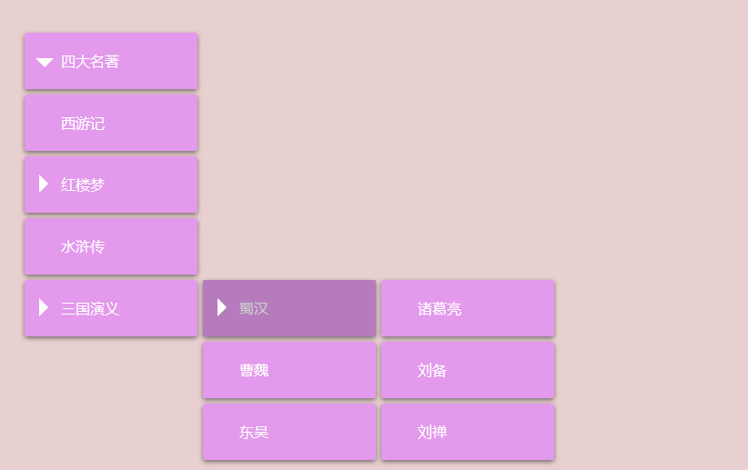

# 多级下拉菜单的制作

## 制作思路

* 静态页面的制作
* 动态特效的实现——下拉菜单的显示和隐藏
  * css
  * jquery
  * js
* 浏览器兼容问题

### HTML+CSS静态页面的制作相关知识点

* float
* display:block
* position 元素的定位
* a:hover鼠标结果的状态
* onmouseover鼠标经过
* onmouseout鼠标离开

### 详细思路

1、初始化设置

2、设置最外层ul的宽度和高度 margin值

3、设置所有ul的list类型为none

4、设置li的位置属性为relative，背景色

5、设置所有的a为块元素，对其文字格式进行设置，text-decoration、font-size、color、font-weight、text-align、line-height

6、设置滑动li时子元素a背景色的变换 li:hover>a

7、设置子级ul位置属性为absolute，显示方式为none，并设置其top为0，left为100%

8、设置当划过第一级li时，二级ul以块元素显示出来

### 页面效果

  